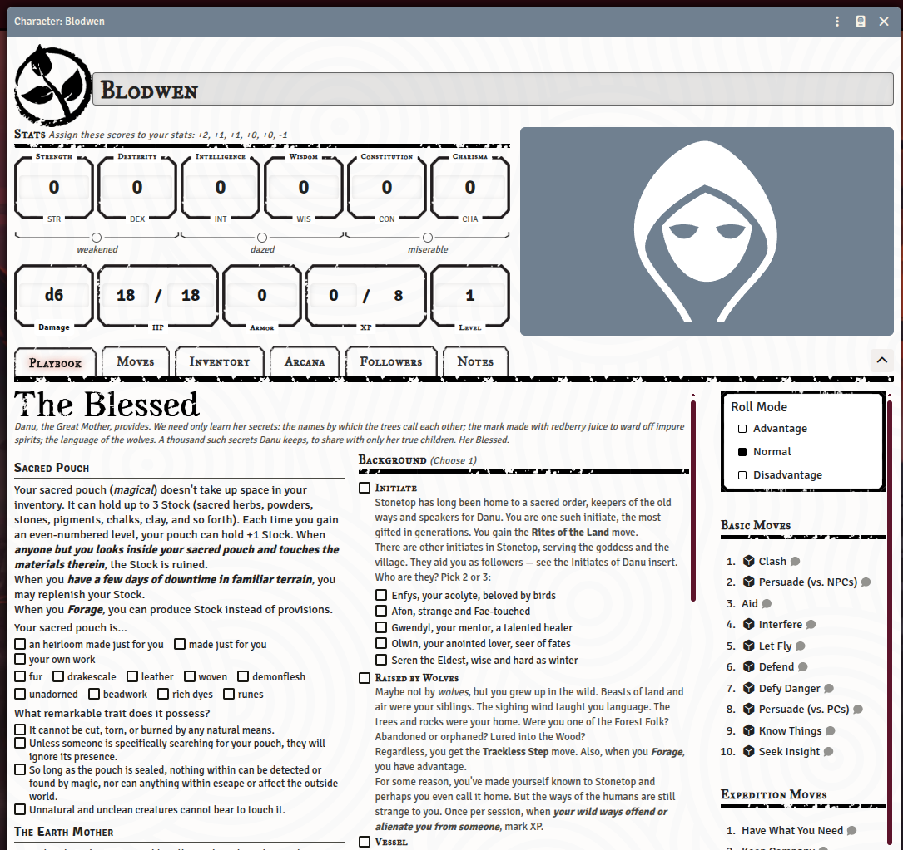
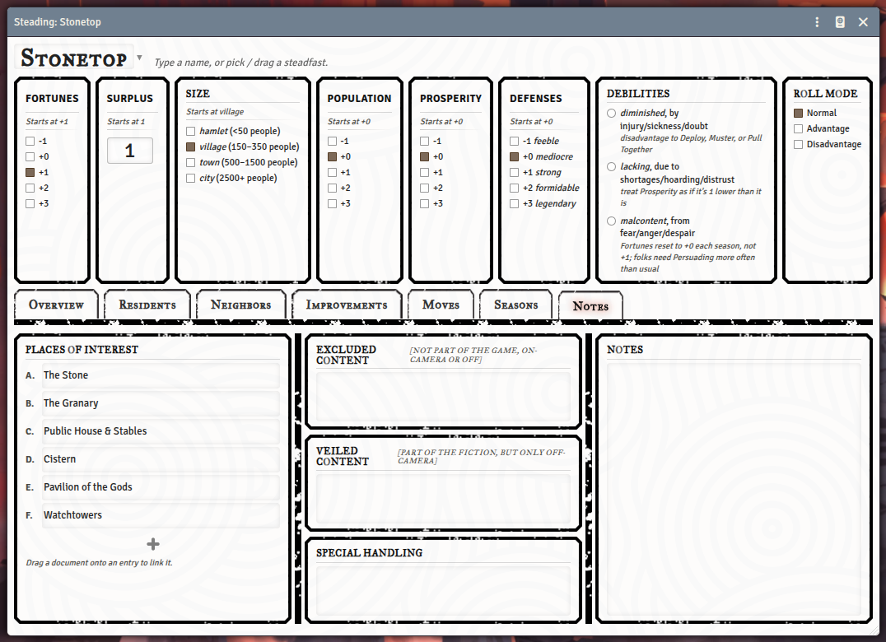
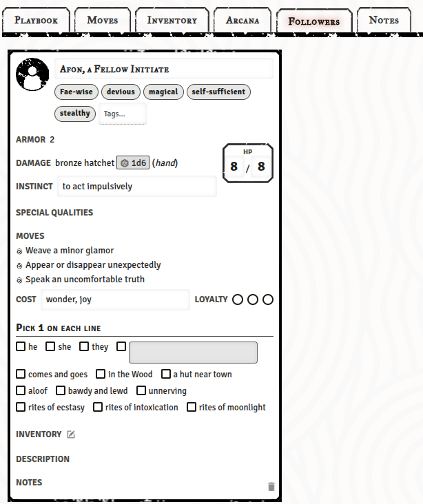
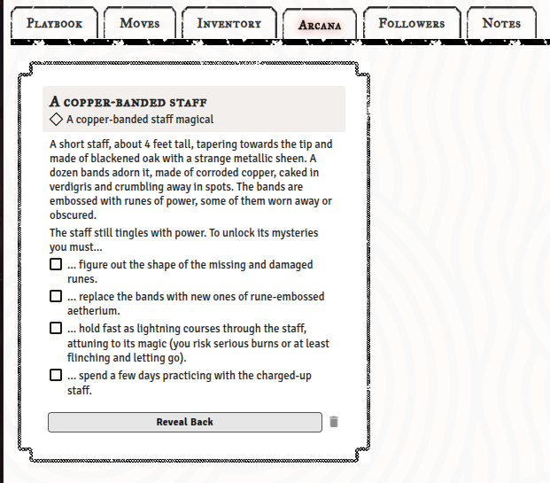
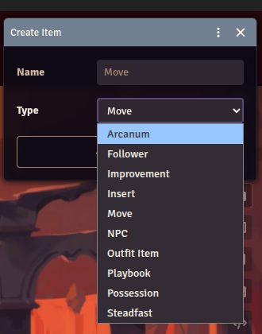
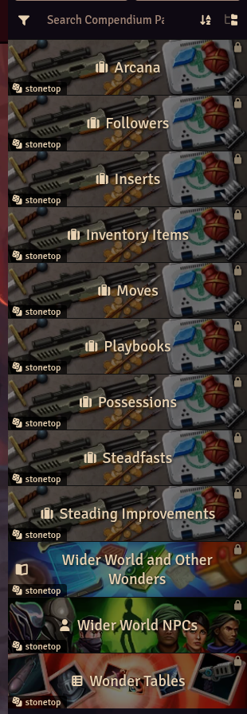
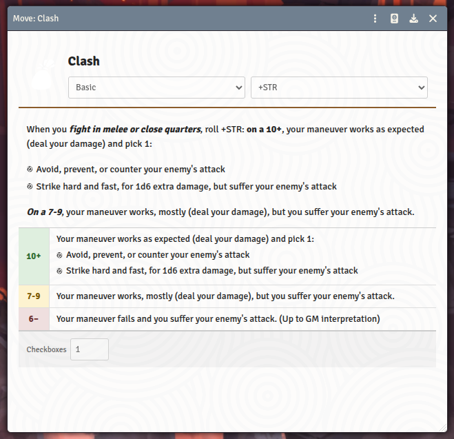

# Stonetop for Foundry VTT

An unofficial [Foundry VTT](https://foundryvtt.com) system for playing [Stonetop](https://plusoneexp.com/collections/stonetop) by Jeremy Strandberg.



## Features

- **Full character sheets** -- a playbook that reads like the book and provides real check boxes to track abilities and moves.
- **Steading sheets** -- all the stats and fields you need. Drop a journal entry or actor onto a place of interest to link it.
- **Moves** -- rollable with results and debilities applied.
- **Followers** -- live on the character sheet as cards. Premade can be dropped and custom can be created.
- **Arcana** -- live on the character as cards, tracking the mysteries you must unravel to unlock them, with a **Reveal Back**
  flip to see what powerful item awaits.
- **Everything is an item** -- arcana, followers, improvements, inserts, moves, NPCs, outfit items, playbooks, possessions and
  steadfasts are all first-class item types. Author your own in the Items directory and drag them onto any sheet.
- **Comprehensive compendium packs** -- moves, playbooks, gear, arcana, steading improvements, and book II threats and tables.

<details>
<summary><b>More screenshots</b></summary>

<table>
<tr>
<td valign="top"><b>Steading sheet</b><br></td>
<td valign="top"><b>Followers</b><br></td>
</tr>
<tr>
<td valign="top"><b>Arcana</b><br></td>
<td valign="top"><b>Every type is an item</b><br></td>
</tr>
<tr>
<td valign="top"><b>Compendium packs</b><br></td>
<td valign="top"><b>Moves</b><br></td>
</tr>
</table>

</details>

## Prerequisites

- Foundry VTT v13 or v14

## Installation

In Foundry VTT, go to **Game Systems → Install System** and paste this manifest URL:

```
https://github.com/taylor-nightingale/stonetop/releases/latest/download/system.json
```

### Art assets

The book illustrations are copyrighted and aren't shipped with the system. If you own the book PDFs, install the art
from inside Foundry: **Settings → Configure Settings → Stonetop → Install Artwork**, then select your PDFs -- extraction
runs in your browser and works on hosted servers. The game works fine without the art. Command-line extraction is also
available; see [`stonetop-art/README.md`](stonetop-art/README.md).

## Development

```bash
npm install        # install dev dependencies
npm run pack       # compile JSON source into LevelDB compendium packs
npm run unpack     # extract packs back to JSON source
npm test           # run tests
```

## License

Code is licensed under the [MIT License](LICENSE).

Some CSS/HTML and assets derived with permission from dice-goblin's beautiful [stonetop system](https://github.com/Dice-Goblin-Click-Clack/Stonetop)

Game content (and trade dress) are derived from [Stonetop](https://plusoneexp.com/collections/stonetop) by Jeremy Strandberg and used under [CC BY-SA 4.0](https://creativecommons.org/licenses/by-sa/4.0/).

The Stonetop illustrations are Lucie’s (C), and should not be distributed in this repository.

## A note on AI training

The maintainers ask that the contents of this repository -- both code and text -- not be used to train machine-learning or generative-AI models or datasets.

The code remains under the MIT License and the game content under CC BY-SA 4.0; nothing here adds restrictions to the rights those licenses grant. We simply ask that you respect this preference.
