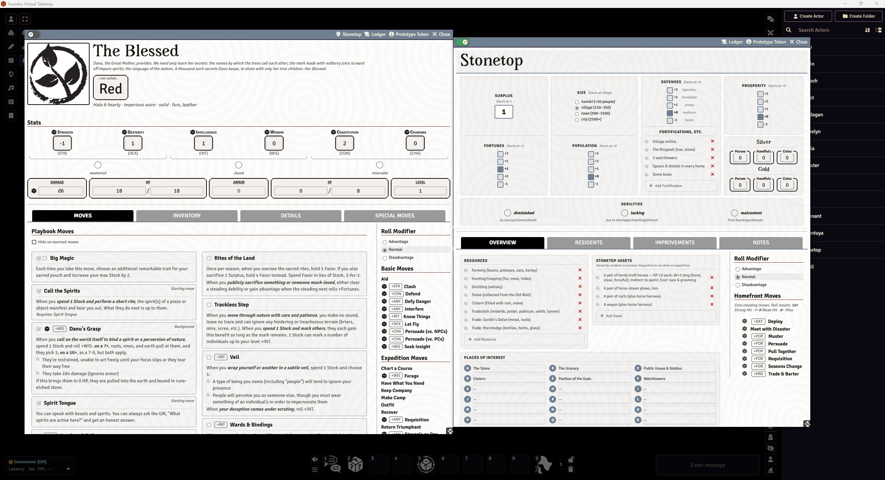

# Stonetop for Foundry VTT

An unofficial [Foundry VTT](https://foundryvtt.com) system for playing [Stonetop](https://plusoneexp.com/collections/stonetop) by Jeremy Strandberg.

> This system is under active development and may be unstable.

## Features

### Guided Character Creation

A multi-step onboarding wizard handles everything from playbook selection to the final starting move. Each playbook's unique setup is fully supported: backgrounds with conditional forms, appearance builders, stat allocation, starting moves and invocations, crew and animal companion configuration, lore questions, and Seeker arcana. Progress is saved so players can pause and return without losing their work.

### Guided First Session

The GM gets a **Welcome** guide and a **Let Spring Burst Forth** walkthrough that frames the village's opening scene step by step, with one-click sharing of the right journals to the table. Players see a guided creation intro and a **resumable** onboarding flow, while the GM watches a live roster fill in as each character is finished — and a **New to Foundry?** primer helps first-time Foundry users find their feet.

### Automated Move Rolls

Every move roll goes through a pre-roll dialog that shows active **Forward** and **Ongoing** modifiers (Forward clears automatically after use), then lets the player choose Normal, Advantage, or Disadvantage — and offers an alternate stat for moves that allow one. Results are classified as Strong Hit (10+), Weak Hit (7–9), or Miss (6−) automatically, the roll card spells out what happens at each tier, and a miss instantly awards +1 XP. Debilities apply disadvantage to the correct stat and annotate the card so the table always knows why.

### Level-Up Wizard

Clicking Level Up opens a step-by-step wizard: it shows the XP cost, presents every move the character is eligible for (locking moves whose prerequisites aren't met), and — on even levels — surfaces available Invocations. Confirming the wizard applies the new level, deducts XP, and adds the chosen move to the sheet in one click.

###  End of Session Macro

A **End of Session** macro is automatically slotted into hotbar slot 10. The GM checks off which of the four group XP criteria were met and the system awards XP to every player-owned character simultaneously, then posts a summary to chat.

### Death's Door Dialog

When a character hits 0 HP, a three-step walkthrough explains the Death's Door rules — what it means, how the roll works, and what the possible outcomes are — so no one has to look it up mid-session.

### Outfit & Inventory Management

The Outfit Move dialog lets players check off items and see their load level update in real time. The system calculates armor automatically from equipped items (base + modifiers) and tracks pool slots, small item limits (tied to steading prosperity), and per-item resources like rations and ammo.

### Followers

Build a follower from scratch with a guided builder, or turn any bestiary monster into a follower in one step. Each follower lives on a single card with per-section editing for instinct, moves, cost, and tags, keeping warbands, hirelings, and animal companions tidy on the character sheet.

### Steading Sheet & Seasonal Automation

The Stonetop steading sheet tracks Fortunes, Prosperity, Population, and Defense alongside the debility system (Diminished, Lacking, Malcontent). Steading moves are wired up: **Meet with Disaster** auto-applies the Fortunes penalty and picks a consequence; **Seasons Change** steps through the full seasonal checklist with automatic resource updates and nudges each player with a personal upkeep reminder; **Muster** deducts Fortunes before the roll. A seasonal **Weather** oracle and an **Expedition** GM walkthrough round out the homefront tools, and improvements gate their completion behind the requirements you've checked off.

### GM Result Controls

After any roll, the GM can shift the result up or down by one tier directly from the chat card — Strong Hit → Weak Hit → Miss (and back) — without re-rolling. Characters with the Burn Brightly feature can spend 2 XP from the chat card to bump a recent roll by +1.

## Screenshots



---

## Prerequisites

- Foundry VTT v13 or v14

## Installation

In Foundry VTT, go to **Game Systems -> Install System** and paste this manifest URL:

```
https://github.com/PrinceWitherdick/stonetop/releases/latest/download/system.json
```

## Recommended Modules

- **[Dice So Nice!](https://foundryvtt.com/packages/dice-so-nice)** — renders 3D dice rolls on the tabletop. Every move, damage, and steading roll in this system uses Foundry's dice, so Dice So Nice adds a tactile sense of immersion to the table without any extra setup.

## Development

```bash
npm install        # install dev dependencies
npm run pack       # compile JSON source into LevelDB compendium packs
npm run unpack     # extract packs back to JSON source
npm test           # run tests
```

## License

Code is licensed under the [MIT License](LICENSE).

Game content is derived from [Stonetop](https://plusoneexp.com/collections/stonetop) by Jeremy Strandberg and used under [CC BY-SA 4.0](https://creativecommons.org/licenses/by-sa/4.0/).

[Some assets](assets/playbooks/ATTRIBUTION.md) sourced from [game-icons.net](https://github.com/game-icons/icons) are used under [CC BY 3.0](https://creativecommons.org/licenses/by/3.0/).
